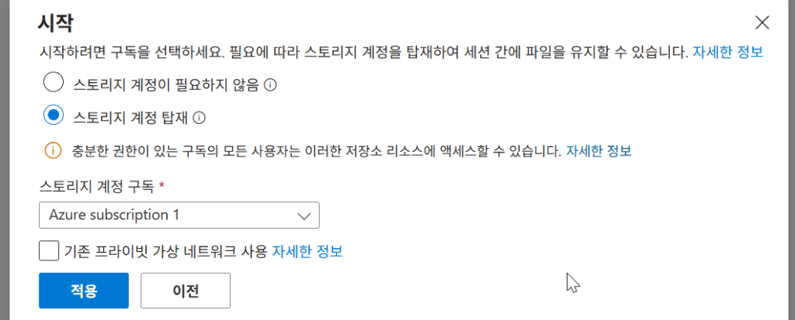
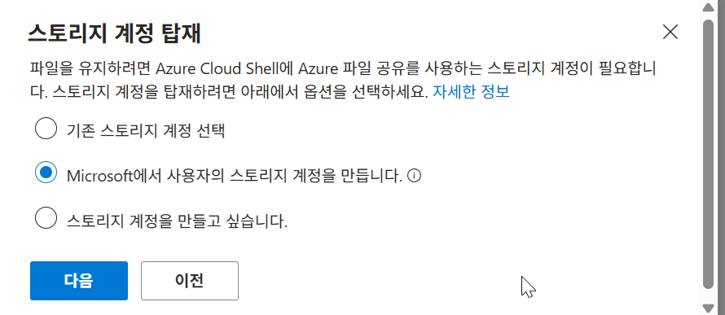
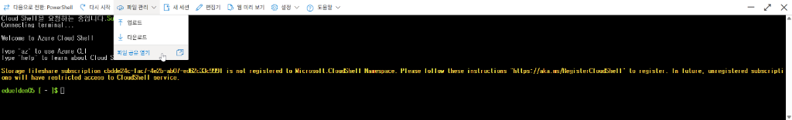

# Azure Resource Topology Auto-Generator (ARTAG)

A tool to automatically scan Azure Resource Groups and generate editable Topology Diagrams (PPTX/PNG) using official Azure Icons.

## Features
-   **One-Liner Scan**: Uses Azure Cloud Shell (`az graph`, `az resource`) to scan connectivity.
-   **Graph Layout**: visualizes VNet -> Subnet -> Resource hierarchy with connected lines.
-   **Official Icons**: Dynamically maps Azure Public Service Icons (SVG) to resources.
-   **Traffic Flow**: Distinguishes between Physical containment, Traffic flow (LoadBalancer), and Association links.
-   **Editable Output**: Generates `.pptx` where every icon and line is a separate editable object.

## Prerequisites
-   Azure CLI (or Cloud Shell)
-   Python 3.9+
-   (Optional) Azure Public Service Icons downloaded to `Azure_Public_Service_Icons/Icons`.

## Installation

1.  Clone this repository.
2.  Install dependencies:
    ```bash
    python -m venv venv
    source venv/bin/activate  # Windows: venv\Scripts\activate
    pip install -r server/requirements.txt
    ```
3.  Download [Azure Public Service Icons](https://learn.microsoft.com/en-us/azure/architecture/icons/) and extract to:
    `Azure_Public_Service_Icons/Icons`

## Usage

### 1. Azure Cloud Shell Setup (Important!)
This tool generates the topology data using a shell script, so you **MUST use the Bash environment** in Azure Cloud Shell, NOT PowerShell.

1.  Open **[Azure Cloud Shell](https://shell.azure.com)**.
2.  If prompted, select **Bash** (not PowerShell).
3.  **Mount Storage**: You must create a storage account to save the generated files.
    *   Select "Mount Storage" (스토리지 계정 탑재).
    
    *   Select "Create new storage account" (Microsoft에서 사용자의 스토리지 계정을 만듭니다).
    

### 2. Run Generation Script
1.  **Upload Scripts**:
    *   In the Cloud Shell toolbar, click the **"Manage files"** icon -> **"Open file share"** (또는 "Upload/Download").
    *   Upload `scripts/generate-topology.sh` and `scripts/parse-relations.py` from this repository.
    

2.  **Execute Command**:
    Copy and paste the following command into your Cloud Shell terminal:

    ```bash
    # Give execution permission
    chmod +x generate-topology.sh
    
    # Run the script
    ./generate-topology.sh
    ```

3.  **Download Result**:
    *   Follow the script prompts to select your Subscription and Resource Group.
    *   The script will generate a file named `topology.json`.
    *   Type `download topology.json` in the terminal to save it to your local computer.

### 3. Generate Diagram (server)
1.  Start the local server:
    ```bash
    python server/main.py
    ```
2.  Open `http://localhost:8000` in your browser.
3.  Upload the `topology.json` file you downloaded.
4.  **Download your Topology**:
    *   **PPTX**: Editable PowerPoint file with icons.
    *   **PNG**: High-resolution image.
